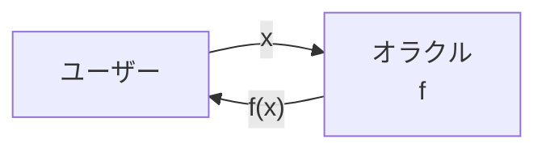
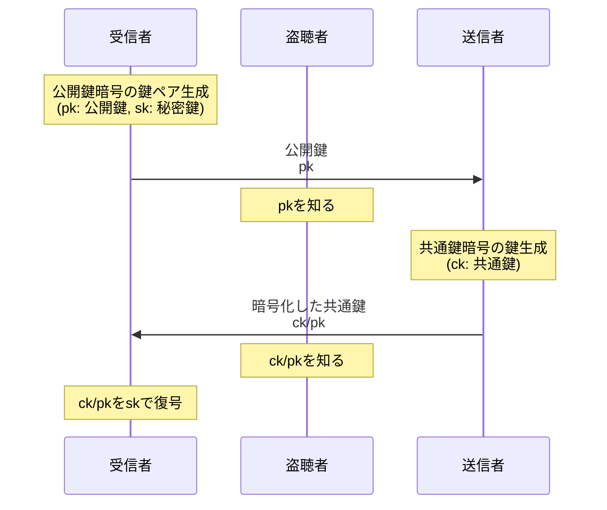
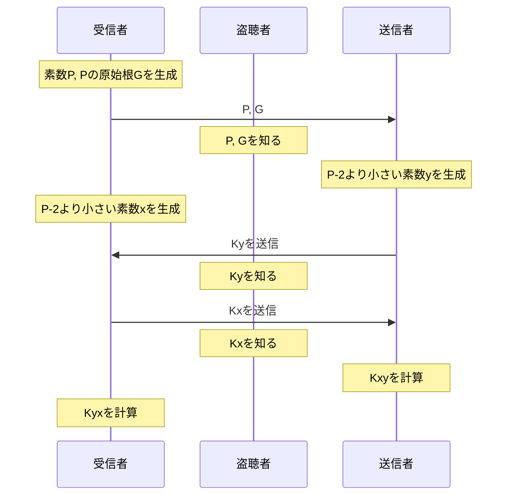

# 暗号の前に

## big-O記法
関数$f, g$に対してある$n_0, c$が存在して，$\forall n \geq n_0$において$f(n) \leq c g(n)$が成立するとき
$$f(n) = O(g(n))$$
と書く．

$f(n)$が$cg(n)$**以下**であればいいことに注意.

$f(n) = O(n)$なら$f(n )= O(n^2)$でもある．

プログラムではループの回数，再帰の回数が支配的でありこれらを計数することで計算量を見積もることができる．

特に時間計算量が$O(g(n))~$(ただし$g$は多項式)であるアルゴリズムを多項式時間アルゴリズムという．

{:#key_space}
## 鍵空間(key space)
鍵になる値の集合のこと．鍵の長さ(ビット長)に比例して爆発的に鍵空間は広くなる．暗号によっては鍵として選択できる値に制限があるため，単純に鍵の長さに比例しない場合もある．

以降，特に断りのない限り復号鍵空間，暗号鍵空間をそれぞれ$\mathbb{K}_D$, $\mathbb{K}_E$とし，復号，暗号化に同じ鍵を使う場合のみ鍵空間を$\mathbb{K}$とする．

{:#plain_text_space}
## 平文空間(plain text space)
平文全ての集合のこと．基本的には任意の文字列となり非可算濃度をもつ．平文に条件を考える場合もあり，暗号の強度は条件によって変わることもある．

暗号化関数の定義域であり，復号関数の値域となる．

以降，特に断りのない限り平文空間を $\mathbb{M}$ とする．

{:#ciphertext_space}
## 暗号文空間(ciphertext space)
暗号文全ての集合のこと．符号の集合となる．決定的な暗号では暗号化鍵と平文空間が決まれば暗号文空間も決定されるが，決定的でない暗号では暗号化鍵と平文空間のみでは暗号文空間が決定できない．

暗号化関数の値域であり，復号関数の定義域となる．

以降，特に断りのない限り暗号文空間を $\mathbb{C}$ とする．ただし，鍵を明示的に指定して $\mathbb{C}_k$と添え字付きで表すこともある．

{:#oracle}
## オラクル(oracle)
要求に対してデータを返す存在のこと．要求する側は計算方法を知らないことがポイント．

例えば関数$f$を計算するオラクルは

このようにユーザーの要求$x$に応じて$f(x)$を返す．

暗号化を行うオラクルを暗号化オラクル．復号を行うオラクルを復号オラクルという．

日本語だと神託という訳になる．計算方法を知らずに神に答えを聞くようなイメージ？

{:#nonce}
## ノンス(nonce)
通信において利用する使い捨ての乱数のこと．
[リプレイ攻撃](#replay_attack)を防ぐために利用する．

{:#hash}
## ハッシュ(hash)
入力が与えられたとき決められた長さの値を返す関数またはその値のこと．
明確にするために値のことをハッシュ値，関数のことをハッシュ関数ということもある．

ハッシュ関数は同じ入力に対して必ず同じ値を返す必要があり，出力から入力を求めることが困難である(一方向性をもつ)必要がある．また多項式時間で計算できることも必要とされる．

ハッシュ値は固定長であるため異なる入力に対して同じ値を出力することがある．これをハッシュ値の衝突という．

ハッシュ関数は改ざん防止や，変更の検知などになどのために利用される．

{:#schema}
## スキーマ(schema)
文章やデータの構造のこと．

通信ではバイト列を送受信するためバイト列を解釈する必要があり，このバイト列の解釈の方法をスキーマという．

{:#protocol}
## プロトコル(protocol)
決まった手順のこと．特に複数人で行う手続きの共通したルールのこと．

通信では相手からのメッセージを待機したり解釈したりするため，共通したルールが必要である．

{:#key_exchange}
## 鍵交換 (key exchange)
相手に鍵をとどけること．復号鍵を盗聴されないように鍵交換する問題のことを鍵交換問題という．

### 公開鍵暗号方式
公開鍵(暗号化鍵)を先に送信し，共通鍵を暗号化鍵で暗号化された共通鍵を受信する方法．

ただしck/pkはckをpkで暗号化したものを表す．

受信者と送信者はckを共有できているが, 盗聴者はpk, ck/pkのみしか知らないためckを知ることができない．

### Diffie-Hellman鍵交換(Diffie-Hellman key exchange: DH)
離散対数問題を利用した鍵交換の手法の一つ．

ただし${\tt Ka} = G^{\tt a} \mod P$とし，${\tt Kab} = (G^{\tt a} \mod P)^{\tt b} \mod P$とする．

ここで$(G^{\tt a} \mod P)^{\tt b} \mod P = G^{\tt ab} \mod P$であるため，$\tt Kxy = Kyx$となる．

よって受信者と送信者は鍵を共有できており，$\tt Kx, Ky$からは$\tt Kxy, Kyx$を計算できないため盗聴者は鍵を知ることができない．

楕円曲線上の離散対数問題を利用する変種(ECDH)が存在する．

# 暗号の分類

{:#commonkey_crypto}
## 共通鍵暗号(common key cryptography)
暗号化と復号に同じ鍵を用いる暗号のこと．
$$ (G: \mathbb{N} \rightarrow \mathbb{K}, E: (\mathbb{K}, \mathbb{M})\rightarrow \mathbb{C}, D: (\mathbb{K}, \mathbb{C})\rightarrow \mathbb{M}) $$
の三つ組で表され，$G$は鍵生成関数，$E$は暗号化関数，$D$は復号関数である．

ここでは簡易化のために
$$ E: \mathbb{K} \rightarrow \mathbb{M} \rightarrow \mathbb{C}\\ D: \mathbb{K} \rightarrow \mathbb{C} \rightarrow \mathbb{M} $$
とする．

これは$E$を鍵が与えられたら暗号化オラクルを返す関数とし，$D$を鍵が与えられたら復号オラクルを返す関数としている．

{:#publickey_crypto}
## 公開鍵暗号(public key cryptography)
暗号化と復号に異なる鍵を用いる暗号のこと．非対称鍵暗号ともいわれる．
$$ (G: \mathbb{N} \rightarrow (\mathbb{K}_E, \mathbb{K}_D), E: (\mathbb{K}_E, \mathbb{M})\rightarrow \mathbb{C}, D: (\mathbb{K}_D, \mathbb{C})\rightarrow \mathbb{M}) $$
の三つ組で表され，$G$は鍵生成関数，$E$は暗号化関数，$D$は復号関数である．

ここでは簡易化のために
$$ E: \mathbb{K}_E \rightarrow \mathbb{M} \rightarrow \mathbb{C}\\ D: \mathbb{K}_D \rightarrow \mathbb{C} \rightarrow \mathbb{M} $$
とする．

これは$E$を鍵が与えられたら暗号化オラクルを返す関数とし，$D$を鍵が与えられたら復号オラクルを返す関数としている．

{:#deterministic_encryption}
## 決定的暗号(deterministic encryption)
鍵と平文が決まれば同じ暗号文が出力される暗号のこと．

{:#probabilistic_encryption}
## 確率的暗号(probabilistic encryption)
鍵と平文が決まっても異なる暗号文が出力される暗号のこと．

{:#block_cipher}
## ブロック暗号(block cipher)
特定のバイト数のブロックごとに暗号化する暗号のこと．

入力のバイト数がブロックサイズの倍数でない場合，入力の端数は穴埋め用の数(パディング, padding)で埋められる．

{:#stream_cipher}
## ストリーム暗号(stream cipher)
1ビットまたは1バイトごとに暗号化する暗号のこと．

# 暗号の数学
## 互いに素(coprime)
二つの整数$a, b$が互いに素であるとは$a, b$をともに割り切る整数が$1$のみであることである．またこれは，$gcd(a, b) = 1$であることと同値である
{:#euler_phi_function}
## オイラー関数(euler's phi function)
オイラー関数は自然数から自然数への関数$\phi: \mathbb{N} \rightarrow \mathbb{N}$であり， $\phi(n)$は$n$以下の$n$と互いに素な数の個数を返す．

### 例
$\phi(1) = 1 = |\{1\}|$

$\phi(10) = 4 = |\{1, 3, 7, 9\}|$

{:#fermat_little_theorem}
## フェルマーの小定理(fermat's little theorem)
$p$を素数，$a$を整数としたとき，
$$ a^p \equiv a \pmod p $$
であることであり，$a$が$p$と互いに素であるとき
$$ a^{p - 1} \equiv 1 \pmod p$$
が成立することを主張する定理．

これを法が素数でなくても成立するように拡張したオイラーの定理が存在する．

{:#euler_theorem}
## オイラーの定理(euler's theorem)
$m$を整数とし, $a$を$m$と互いに素な整数とする．このとき
$$ a^{\phi(m)} \equiv 1 \pmod m $$
を主張する．